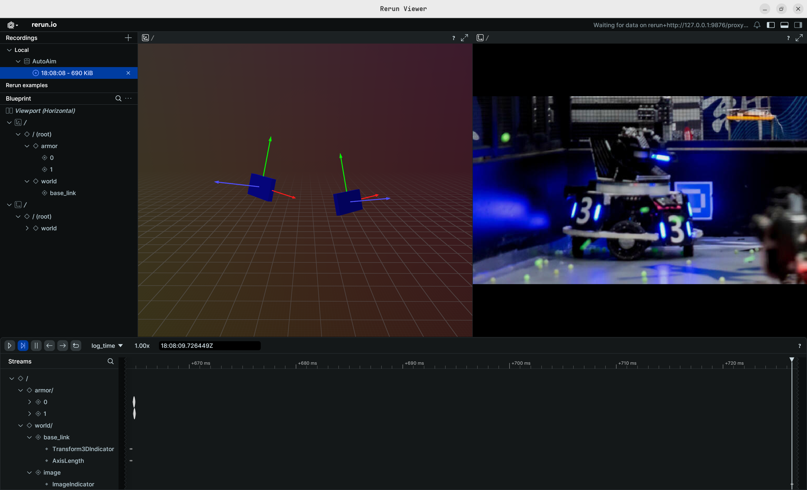

<div align="center">
  <h1>🤖 自 瞄 🎯</h1>
</div>

[](https://www.rust-lang.org/ "Rust官方")
[](https://www.robomaster.com/zh-CN/ "RoboMaster官网")
[](https://space.bilibili.com/1911835891 "3SE战队B站")
[](https://opensource.org/licenses/MIT "MIT协议")
[](https://github.com/pykeio/ort "Rust ONNX运行时")

**🚀 面向 RoboMaster 赛场的高性能自瞄，模块化架构、实时并发、全 Rust 编写、性能炸裂！**

---

## 🧠 特性 Highlights

- 🏆 **面向比赛优化**：针对 `RoboMaster` 赛场需求深度定制，兼顾实时性与可靠性
- 🦀 **全 Rust 实现**：零成本抽象，安全而强大。基于 `ort-rs` 实现跨平台端侧推理部署（支持几乎全部onnxruntime-EP，包括`TensorRT`, `OpenVino`, `RKNN`, `CANN` ... ）
- 🚦 **多线程任务调度**：基于 `tokio` 打造全异步推理流，实时并发
- 🎯 **手搓 PnP 求解器（No OpenCV）**：高度特化 IPPE-PnP 模块，硬编码装甲板参数，省去平面化和各向同性归一化操作，解算速度超快
- ⚙️ **状态估计算法**：基于 `ESKF` 的状态估计器，内置装甲板选择与跟踪模块(Todo)，，使用双装甲板反向投影，机器人解算更加精确
- 📡 **异步消息通信队列**：基于异步机制构建的高性能无锁IPC缓冲区
- 🏗️ **基础设施完善**：结构化日志（tracing）与错误处理（thiserror）高度成熟，保障系统健壮高效
- 🛠️ **超炫酷debug**：基于 [Rerun](rerun.io) 打造一流的 debug 体验



---

## 📡 核心模块简介

| 模块名                | 说明                                   |
| ------------------- | -------------------------------------- |
| `app`               | APPs（同步、异步、测试（待完善））             |
| `lib/rbt_base`      | 几何、数学、pnp 等底层模块                     |
| `lib/rbt_infra`     | 配置、日志、工具库、异步通信支持                   |
| `lib/rbt_mod`       | 包含视觉识别、装甲板选择、控制策略等业务逻辑           |

---

## 💻 开发与运行

### 🛠️ 环境要求

- Rust Stable (未进行 MSRV 测试)

### 🚀 快速运行

```bash
git clone https://github.com/XiaoPengYouCode/auto_aim_rust.git
cargo build --release # 编译库文件
cargo run -p auto_aim_async --release
```

<p align="center">
  &nbsp;&nbsp;&nbsp;
  
  <p align="center">❤️爱来自东南大学3SE战队❤️</p>
</p>
