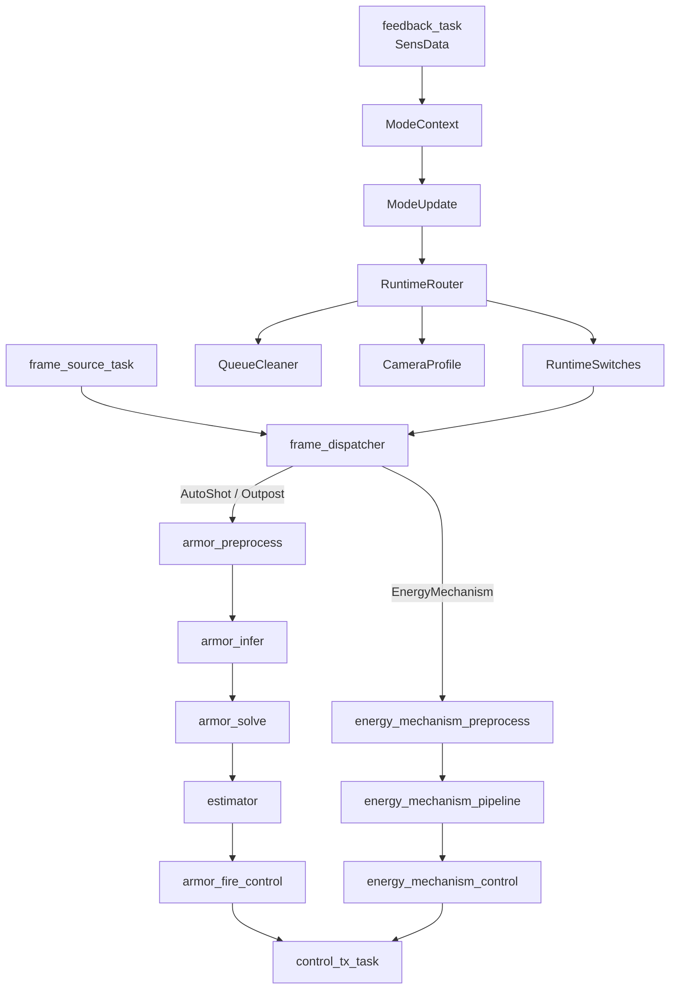
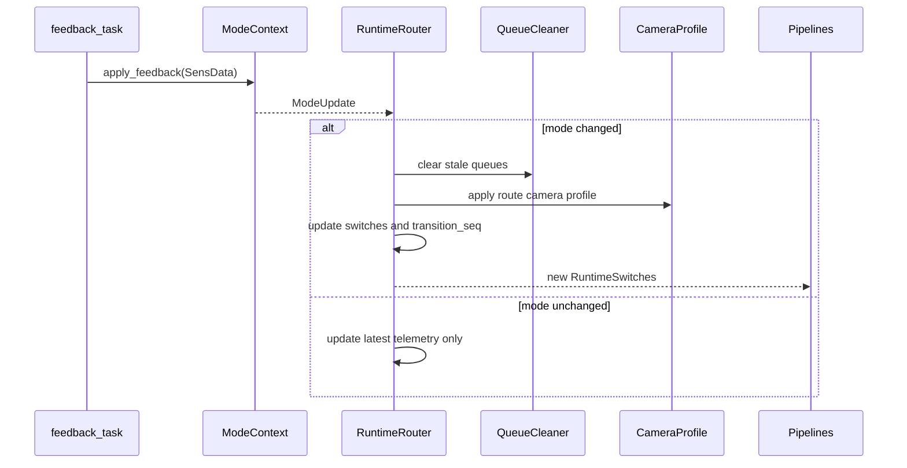

# RFC: Runtime Router 设计文档

- 状态：Draft
- 日期：2026-06-10
- 范围：`auto_aim_rust` 运行时任务模式管理

## 摘要

本文提出一个 `RuntimeRouter`，用于管理自瞄系统中的 Task Mode 切换。

它的核心职责是：

1. 接收下位机反馈 `SensData`。
2. 使用 `ModeContext` 判断当前运行路线。
3. 在模式变化时清理旧队列、重置状态、更新 pipeline 开关。
4. 让 frame source、armor pipeline、energy mechanism pipeline、control task 都从同一个运行时路线读取状态。

`RuntimeRouter` 不是全局大 Context。它不持有模型 session、不持有相机 SDK、不执行算法，只管理运行时路由和切换动作。

## 背景

目标仓库 `vivsionn` 的主线入口是：

```text
main -> ThreadManager::YoloDetect()
```

`YoloDetect()` 会一次性启动多个常驻线程：

- `getVideo`
- `preprocess_yoloimg`
- `yoloInfer0`
- `FireControl`
- `ControlLoop250Hz`
- `energy_mechanism_preprocess`
- `energy_mechanism_pipeline`
- `showResult`

旧仓库并不是在每次 Task Mode 改变时新起一个进程。它采用的是：

```text
一个视觉子进程 + 多个常驻线程 + 模式 flag / condition variable 控制线程是否工作
```

Task Mode 变化发生在 `ThreadManager::applyTaskModeState()`：

- `AUTO_SHOT`：启用装甲板 YOLO 和普通发控，关闭能量机关。
- `HIT_OUTPOST`：启用装甲板 YOLO 和普通发控，同时标记前哨站模式。
- `HIT_BIG_BUFF` / `HIT_SMALL_BUFF`：启用能量机关 pipeline，关闭装甲板 YOLO 和普通发控。
- 模式变化时清理旧队列，避免上一种模式的旧帧和旧结果进入新流程。
- 模式变化时切换相机曝光参数。

Rust 仓库现在已经有：

- `SensData`
- `TaskMode`
- `CtrlData`
- `RbtSPSCQueueAsync`
- `ModeContext`
- `app/auto_aim_async` 的异步 pipeline 雏形

缺少的是一个统一的 runtime 层，把 Task Mode 判断结果应用到异步 pipeline。

## 目标

`RuntimeRouter` 要达成以下目标：

1. 所有 Task Mode 判断收敛到一个入口。
2. 模式切换时统一清理旧队列。
3. pipeline 开关状态从一个地方读取。
4. 支持普通自瞄、前哨站、能量机关三条运行路线。
5. 保持实现简单，可单元测试，可逐步接入现有 `auto_aim_async`。

## 非目标

本 RFC 不做这些事：

- 不实现真实 CAN 设备驱动。
- 不封装相机 SDK。
- 不实现能量机关检测算法。
- 不重写 YOLO 推理和求解逻辑。
- 不改变 `CtrlData` / `SensData` 通讯协议。
- 不引入每个模式一个进程的架构。
- 不设计一个持有所有资源的全局 Context。

## 设计原则

### 单进程，多 task 常驻

Runtime Router 不负责 spawn/kill pipeline。

推荐运行模型是：

```text
单进程 + 多 Tokio task + 常驻 pipeline + route 开关
```

原因：

- 模型 session 初始化成本高。
- 实时任务不适合频繁重建资源。
- 常驻 task 更容易控制延迟。
- 和 `vivsionn` 主线行为一致。

### 判断和执行分离

`ModeContext` 只判断模式。

`RuntimeRouter` 只应用模式变化。

具体算法由 pipeline 自己完成。

### 切换必须显式

模式变化时必须显式产生这些动作：

- clear queue
- reset mode state
- update switches
- bump transition sequence
- update camera profile

不要让这些行为散落在各个 task 里。

## 术语

### TaskMode

来自下位机反馈的任务模式。

已有枚举：

```rust
pub enum TaskMode {
    AutoShot,
    HitBigBuff,
    HitSmallBuff,
    HitOutpost,
}
```

### ModeRoute

视觉侧实际运行路线。

建议保持三类：

```rust
pub enum ModeRoute {
    AutoShot,
    EnergyMechanism,
    Outpost,
}
```

`HitBigBuff` 和 `HitSmallBuff` 是电控线协议兼容名，视觉侧都映射到 `ModeRoute::EnergyMechanism`。

### ModeContext

纯模式判断层。

输入 `SensData`，输出 `ModeUpdate`。

### RuntimeRouter

运行时路由层。

消费 `ModeUpdate`，更新 pipeline 开关，并执行队列清理等切换动作。

## 总体架构



## 模式映射

| TaskMode | ModeRoute | Armor Pipeline | Energy Mechanism Pipeline | FireControl | 切换动作 |
| --- | --- | --- | --- | --- | --- |
| `AutoShot` | `AutoShot` | 开 | 关 | 开 | 清旧队列，重置能量机关，切普通曝光 |
| `HitOutpost` | `Outpost` | 开 | 关 | 开 | 清旧队列，重置能量机关，切前哨站曝光 |
| `HitBigBuff` | `EnergyMechanism` | 关 | 开 | 能量机关发控 | 清旧队列，重置能量机关，切能量机关曝光 |
| `HitSmallBuff` | `EnergyMechanism` | 关 | 开 | 能量机关发控 | 清旧队列，重置能量机关，切能量机关曝光 |

如果已经处在 `EnergyMechanism` route 内，`HitBigBuff` 和 `HitSmallBuff` 之间切换默认不触发完整 runtime transition。

理由：

- 两者共享能量机关 pipeline。
- 频繁清空能量机关状态可能影响连续预测。
- 如果后续实测大小能量机关需要不同 tracker 状态，再把 `EnergyMechanism` 拆成两个 route。

## API 草案

### RuntimeSwitches

```rust
#[derive(Debug, Clone, Copy, PartialEq, Eq)]
pub struct RuntimeSwitches {
    pub armor_enabled: bool,
    pub energy_mechanism_enabled: bool,
    pub fire_control_enabled: bool,
    pub outpost_mode: bool,
    pub transition_seq: u64,
}
```

`RuntimeSwitches` 只放轻量状态，不放队列和模型对象。

### QueueCleaner

为了保持 `RuntimeRouter` 可测试，队列清理建议通过 trait 或闭包传入。

```rust
pub trait QueueCleaner {
    fn clear_armor_input(&mut self);
    fn clear_armor_output(&mut self);
    fn clear_energy_mechanism_input(&mut self);
    fn clear_energy_mechanism_output(&mut self);
    fn clear_debug_output(&mut self);
}
```

测试中可以用 mock cleaner 统计调用次数。

### CameraProfileApplier

相机参数也不要直接写死在 `RuntimeRouter` 里。

```rust
pub trait CameraProfileApplier {
    fn apply_auto_shot_profile(&mut self);
    fn apply_outpost_profile(&mut self);
    fn apply_energy_mechanism_profile(&mut self);
}
```

真实相机、离线视频和测试 mock 可以分别实现。

### RuntimeRouter

```rust
pub struct RuntimeRouter {
    mode_context: ModeContext,
    switches: RuntimeSwitches,
}

impl RuntimeRouter {
    pub fn new() -> Self;

    pub fn apply_feedback<C, P>(
        &mut self,
        feedback: &SensData,
        queue_cleaner: &mut C,
        camera_profile: &mut P,
    ) -> ModeUpdate
    where
        C: QueueCleaner,
        P: CameraProfileApplier;

    pub fn switches(&self) -> RuntimeSwitches;

    pub fn route(&self) -> Option<ModeRoute>;
}
```

## 切换流程



## transition_seq

`transition_seq` 用于丢弃旧模式下产生的过期结果。

建议规则：

1. 每次 route 变化，`transition_seq += 1`。
2. frame 进入 pipeline 时带上当前 `transition_seq`。
3. pipeline 输出 result 时保留这个 `transition_seq`。
4. control task 消费 result 前检查 seq。
5. 如果 result seq 小于当前 runtime seq，直接丢弃。

这比只清队列更稳。因为异步任务里可能已经有一帧在处理中，清队列无法取消已经开始计算的结果。

## task 接入方案

### feedback_task

职责：

- 读取 CAN、离线回放或 mock feedback。
- 调用 `RuntimeRouter::apply_feedback()`。
- 发布最新 `RuntimeSwitches`。

### frame_source_task

职责：

- 读取图像帧。
- 附带最新 feedback 快照。
- 附带当前 `transition_seq`。

### frame_dispatcher

职责：

- 根据 `RuntimeSwitches` 投递帧。
- `armor_enabled == true` 时投递到 armor queue。
- `energy_mechanism_enabled == true` 时投递到 energy mechanism queue。
- 两者都 false 时丢帧。

### armor_pipeline

职责：

- 处理 armor queue。
- 输出 solved armor / target state。
- 输出结果带 `transition_seq`。

### energy_mechanism_pipeline

职责：

- 处理 energy mechanism queue。
- 输出能量机关控制结果。
- 输出结果带 `transition_seq`。

### control_task

职责：

- 固定频率运行。
- 根据当前 route 选择控制来源。
- 检查 result seq 是否仍然有效。
- 没有有效目标时发送 no-target 控制。

## 并发模型

推荐共享方式：

- `RuntimeSwitches` 用 `watch` channel 发布。
- frame/result 走 latest-only queue。
- control task 保留最近一次有效目标状态。
- `RuntimeRouter` 只在 feedback task 内部可变持有。

不建议：

- 多个 task 共享一个可写 `RuntimeRouter`。
- 到处传 `Arc<Mutex<GlobalContext>>`。
- pipeline 自己判断复杂 Task Mode。

推荐结构：

```text
feedback_task owns RuntimeRouter
feedback_task publishes RuntimeSwitches
other tasks subscribe RuntimeSwitches
```

这样写锁范围最小，也最容易调试。

## 反馈超时策略

通讯层已有：

```text
FEEDBACK_STALE_TIMEOUT_MS = 500
```

建议策略：

1. 短时间没有新 feedback：保持当前 route。
2. feedback 超过 stale timeout：control task 降级为 no-target。
3. 长时间无 feedback：进入 safe 状态，停止发射，只保留图像处理和调试输出。

`RuntimeRouter` 可以暴露一个轻量方法：

```rust
pub fn mark_feedback_stale(&mut self);
```

但第一版可以先让 control task 根据 feedback 时间戳自行降级。

## 模式抖动策略

第一版不做防抖。

原因：

- Task Mode 应该由电控侧稳定给出。
- 视觉侧防抖可能延迟真实切换意图。
- 先记录 transition 频率，后续根据实测决定是否加最小驻留时间。

如果需要防抖，建议加在 `RuntimeRouter`，不要加在各个 pipeline。

## 测试计划

### ModeContext 测试

已有核心测试：

- 首帧 `AutoShot` 进入 armor route。
- 重复 `AutoShot` 不清队列。
- `AutoShot -> HitBigBuff` 进入 EnergyMechanism。
- `HitBigBuff -> HitSmallBuff` 不重复 transition。
- `EnergyMechanism -> HitOutpost` 进入 Outpost。
- reset 后状态清空。

### RuntimeRouter 单元测试

需要新增：

- `AutoShot -> EnergyMechanism` 会清所有相关队列。
- `EnergyMechanism -> AutoShot` 会清队列并关闭能量机关。
- `AutoShot -> Outpost` 会更新 `outpost_mode`。
- 重复同 route 不清队列。
- `transition_seq` 只在 route 变化时递增。
- camera profile 只在 route 变化时应用。

### 并发集成测试

使用 mock feedback 和 mock frame source：

```text
0s AutoShot
5s HitBigBuff
10s AutoShot
15s HitOutpost
```

验证：

- frame 投递到正确 pipeline。
- route 变化时旧队列被清空。
- 旧 `transition_seq` 的 result 被 control task 丢弃。
- no-target 降级不会发送 auto fire。

## 迁移计划

### Phase 1: ModeContext

状态：已完成。

文件：

- `lib/src/rbt_mod/rbt_mode_context.rs`
- `lib/src/rbt_mod.rs`

### Phase 2: RuntimeRouter

新增：

- `RuntimeRouter`
- `RuntimeSwitches`
- `QueueCleaner`
- `CameraProfileApplier`

要求：

- 只做库层。
- 不接真实相机。
- 不改推理 pipeline。
- 单元测试覆盖 route 切换。

### Phase 3: 接入 auto_aim_async

改造：

- 新增 feedback task。
- 新增 frame dispatcher。
- 用 `watch` channel 发布 `RuntimeSwitches`。
- frame/result 附带 `transition_seq`。

要求：

- 先跑通 `AutoShot`。
- EnergyMechanism route 可以先只清队列和丢帧，不要求算法完整。

### Phase 4: EnergyMechanism route 完整接入

改造：

- 接入 energy mechanism preprocess。
- 接入 energy mechanism pipeline。
- 接入 energy mechanism control。
- 验证 `AutoShot <-> EnergyMechanism <-> Outpost` 切换。

## 取舍

### 为什么不是每个模式一个进程

不选。

理由：

- 模型和相机重建成本高。
- 进程间状态同步更复杂。
- 控制环实时性更难保证。
- 和目标仓库主线不一致。

### 为什么不是一个全局 Context

不选。

理由：

- 容易把相机、队列、模型、发控都塞进去。
- 后续很难测试。
- 修改边界会变模糊。

### 为什么使用 RuntimeRouter

选择。

理由：

- 足够简单。
- 只管运行路线。
- 可以单测。
- 能自然对齐现有 `ModeContext`。
- 后续接入 `auto_aim_async` 成本低。

## 结论

推荐引入 `RuntimeRouter` 作为 Task Mode 的运行时路由层。

最终结构保持为：

```text
ModeContext 负责判断模式
RuntimeRouter 负责应用切换
Pipeline 负责执行算法
Control task 负责固定频率输出
```

这套方案对齐 `vivsionn` 的主线运行方式，同时比旧仓库的 `ThreadManager` 更容易测试和演进。
