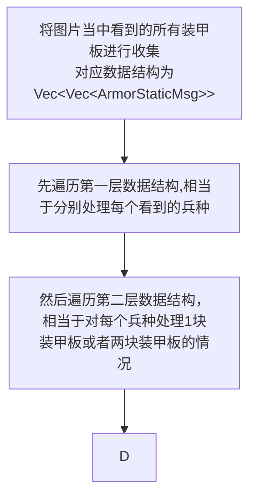

# 如何处理图片当中的一帧

先看一张图片可能出现那几种情况，以及如何处理

- 没有看到装甲板
  - 处理方法
    - 如果 `infer` 步骤没有找到，就不往之后步骤通讯队列里 `push` 新东西，自然就没有后面的步骤了
- 看到同数字的装甲板(1块或者2块)
  - 处理方法
    - 直接输入 `ESKF` 
    - `ESKF` 中的步骤，根据 1 块或 2 块 分别进行不同的处理
- 看到不同数字的装甲板(对应 n 个敌人)
  - 处理方法
    1. 需要对装甲板数据做分类，使用一个容器存储每个看到的敌人的装甲板信息
    2. 遍历容器，分别输入各敌人对应的 `ESKF` 中进行数据更新，更新的过程中同看到同数字的装甲板

所以其实看到 0 个或者 1 个敌人，其实可以被认为是 n 个敌人的特例，也就是说只要这个系统设计好，就可以用一个流程同时处理不同的情况

